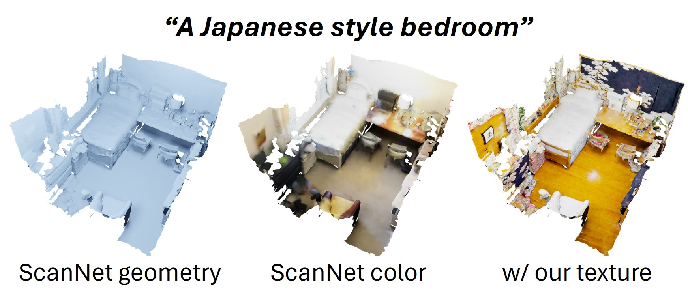
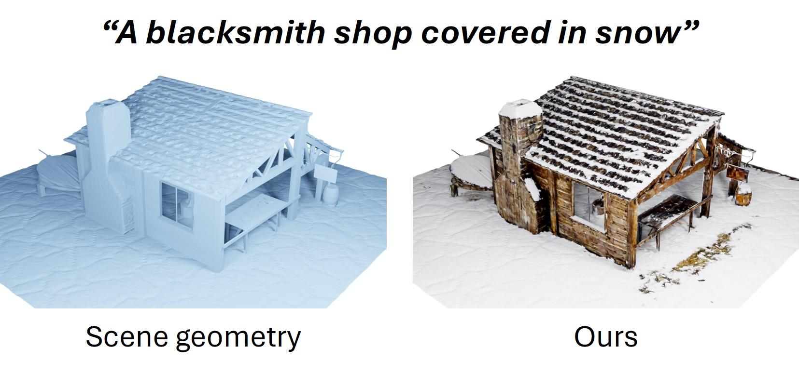

# SceneTex: High-Quality Texture Synthesis for Indoor Scenes via Diffusion Priors

<p align="center"></p>

## Introduction

We propose SceneTex, a novel method for effectively generating high-quality and style-consistent textures for indoor scenes using depth-to-image diffusion priors. 
Unlike previous methods that either iteratively warp 2D views onto a mesh surface or distillate diffusion latent features without accurate geometric and style cues, SceneTex formulates the texture synthesis task as an optimization problem in the RGB space where style and geometry consistency are properly reflected. 
At its core, SceneTex proposes a multiresolution texture field to implicitly encode the mesh appearance. 
We optimize the target texture via a score-distillation-based objective function in respective RGB renderings. 
To further secure the style consistency across views, we introduce a cross-attention decoder to predict the RGB values by cross-attending to the pre-sampled reference locations in each instance.
SceneTex enables various and accurate texture synthesis for 3D-FRONT scenes, demonstrating significant improvements in visual quality and prompt fidelity over the prior texture generation methods.

Please also check out the project website [here](https://daveredrum.github.io/SceneTex/).

For additional detail, please see the SceneTex paper:  
"[SceneTex: High-Quality Texture Synthesis for Indoor Scenes via Diffusion Priors](https://arxiv.org/abs/2311.17261)"  
by [Dave Zhenyu Chen](https://www.niessnerlab.org/members/zhenyu_chen/profile.html), [Haoxuan Li](),
[Hsin-Ying Lee](https://research.snap.com/team/team-member.html#hsin-ying-lee),
[Sergey Tulyakov](https://research.snap.com/team/team-member.html#sergey-tulyakov), and [Matthias Nießner](https://www.niessnerlab.org/members/matthias_niessner/profile.html)  
from [Technical University of Munich](https://www.tum.de/en/) and [Snap Research](https://research.snap.com/).

## Setup

The code is tested on Ubuntu 20.04 LTS with PyTorch 2.0.1 CUDA 11.7 installed. Please follow the following steps to install PyTorch first. To run our method, you should at least have a NVIDIA GPU with 48 GB RAM (NVIDIA RTX A6000 works for us).

```shell
# create and activate the conda environment
conda create -n scenetex python=3.9
conda activate scenetex

# install PyTorch 2.0.1
conda install pytorch==2.0.1 torchvision==0.15.2 torchaudio==2.0.2 pytorch-cuda=11.7 -c pytorch -c nvidia
```

Then, install PyTorch3D:

```shell
# install runtime dependencies for PyTorch3D
conda install -c fvcore -c iopath -c conda-forge fvcore iopath
conda install -c bottler nvidiacub

# install PyTorch3D
conda install pytorch3d -c pytorch3d
```

Install `xformers` to accelerate transformers:

```shell
conda install xformers -c xformers
```

Install tinycudann:

```shell
pip install git+https://github.com/NVlabs/tiny-cuda-nn/#subdirectory=bindings/torch
```

Install the necessary packages listed out in requirements.txt:

```shell
pip install -r requirements.txt
```

### 3D-FRONT scenes

Please download the [3D-FRONT scenes](https://www.dropbox.com/scl/fi/ql0dfgglw14puwr2opyeo/3D-FRONT_preprocessed.zip?rlkey=4d2hxgl8cyi0g0dqrbc6axsn4&dl=0), and unzip it under `data/`. You should be able to see the preprocessed data constructed as follows:

```
data/
    |-- 3D-FRONT_preprocessed/
        |-- scenes/
            |-- <scene_id>
                |-- <room_id>
                    |-- meshes/
                    |-- cameras/
```

#### Usage

To make sure everything is set up and configured correctly, you can run the following script to generate texture for a 3D-FRONT scene.

```shell
./bash/bohemian.sh
```

All generated assets should be found under `outputs`. To configure the style or the target scene, you can run the following script:

```shell
stamp=$(date "+%Y-%m-%d_%H-%M-%S")
log_dir="outputs/" # your output dir
prompt="a bohemian style living room" # your prompt
scene_id="93f59740-4b65-4e8b-8a0f-6420b339469d/room_4" # preprocessed scene

python python scripts/train_texture.py --config config/template.yaml --stamp $stamp --log_dir $log_dir --prompt "$prompt" --scene_id "$scene_id"
```

We provide a template file for all critical parameters in `config/template.yaml`. Please take a look at it in case you want to further costumize the optimization process.

### :star2: Try on your own scenes :star2:

Our method is of course not limited to 3D-FRONT synthetic scenes. It can also be applied to your own synthetic scenes, and even to real indoor scenes such as ScanNet or to outdoor scenes. Here, we provide a thorough guideline for setting up the input data structure.

On a high level, your data should be constructed under `data/` like this:

```
data/
    |-- <your-data-dir>/               # this is the root directory for your meshes
        |-- <name-of-your-scene>/      # name your scene as you like, e.g. living_room/
            |-- cameras/               # root dir of all pre-sampled cameras
                |-- sphere.yaml        # (if applicable) spherical cameras pointing at the scene center
                |-- blender.json       # (if applicable) interpolated cameras in the scene via Blender
                |-- blenderproc.json   # (if applicable) sampled cameras in the scene via BlenderProc
            |-- meshes/                # root dir of all your mesh data
                |-- stuff/             # dir of structural meshes, e.g. wall, floor, ceiling, etc.
                    |-- 0_wall.obj
                    |-- 0_wall.mtl     # note .mtl is not necessary - we only support .obj with single material
                    |-- ...
                    |-- (or simply use a composed 0_room.obj for the whole scene structure)
                |-- things/            # dir of object meshes, e.g. table, chair, lamp, etc.
                    |-- 1_table.obj
                    |-- 1_table.mtl
                    |-- ...
                |-- scene_config.json  # configuration file, see details below
                |-- scene.obj          # (if applicable) a composed .obj file for the whole scene, 
                |-- scene.mtl          # (if applicable) a scene material, note only a single material is supported
                |-- (provide scene.obj and scene.mtl if the instance segmentations are not available)

```

#### Cameras

We provide three types of the pre-sampled cameras: spherical cameras, Blender cameras, and [BlenderProc](https://github.com/DLR-RM/BlenderProc). We recommend the spherical cameras as the default cameras for its wider coverage of the scene surface. The other two can be additionally applied when needed. We assume Y is up and -Z is forward.

1. Spherical Cameras

The camera parameters should be defined in `sphere.yaml` as the following example:

```yaml
# sphere camera space
dist:                     # distance to the sphere center
  min: 0.5                # min and max are usually set to the same value
  max: 0.5
  num_linspace: 1         # sphere diameter is recommended to remain unchanged

elev:                     # elevations from XZ-plane
  min: -30
  max: 30
  num_linspace: 10        # number of evevations between min and max

azim:                     # azimuths to -Z
  min: -180
  max: 180
  num_linspace: 100       # number of azimuths between min and max

fov:                      # field-of-views
  min: 45
  max: 75
  num_linspace: 5         # number of field-of-view between min and max

at: [[3.0, 0.75, -0.4]]   # sphere center (not necessarily the scene center)
```

Please note all parameters should be defined according to your own data. It's recommended to check the measure info of scene mesh in MeshLab first.

2. Blender Cameras

Interpolate cameras from selected Blender keyframes are much straightforward in terms of visualization. Please refer to online tutorials of Blender keyframes for more info. We provide a python script for saving the interpolated Blender cameras in `tools/save_blender_cameras.py`. To apply it, please copy and paste this script in Blender (new script in `Scripting`).

The Blender cameras should be saved under `cameras/` and renamed to `blender.json`.

3. BlenderProc Cameras

To avoid all manual efforts, we also support automatically sampled cameras from BlenderProc scripts. All cameras are randomly sampled in the scene based on a pre-defined sampling rule, such as heights from the ground, number of visible instances, etc.. Please refer to [this tutorial](https://github.com/DLR-RM/BlenderProc/tree/main/examples/datasets/front_3d#front3dcamerasampler) for more info. Note that you might have to flip/rotate your mesh first.

The Blender cameras should be saved under `cameras/` and renamed to `blenderproc.json`.

#### Meshes

All mesh data should be constructed as described above. Structural .obj files can be composed to a single `0_room.obj` for simplicity. If you don't have the segmented objects for the scene, you can also put a single `scene.obj` there. Please note we only support a single material for each input .obj file. We only support triangular meshes.

No matter how you construct the input mesh data, it's critical to define all meshes in the `scene_config.json` file. Here, we provide an example for it:

```json
{
    "0": {
        "name": "room",                                                # name of the object
        "type": "stuff",                                               # type of the object
        "path": "data/examples/living_room/meshes/stuff/0_room.obj",   # path to the object
        "prompt": "a living room"                                      # description of the object
    },
    "1": {
        "name": "table",
        "type": "things",
        "path": "data/examples/living_room/meshes/things/1_table.obj",
        "prompt": "a table"
    },
    "2": {
        "name": "lamp",
        "type": "things",
        "path": "data/examples/living_room/meshes/things/2_lamp.obj",
        "prompt": "a lamp"
    }
}
```

If you only have a mesh without segmentations for the whole scene, you can simply define the scene as:

```json
{
    "0": {
        "name": "room",
        "type": "stuff",
        "path": "data/examples/meshes/scene.obj",   # everything is composed to this single .obj file
        "prompt": "a room"
    }
}
```

This is quite flexible especially when you want to texture a reconstructed scene such as ScanNet.

#### Run it!

After the input mesh data is set up, you should adjust all critical parameters in `config/template.yaml`. Most importantly, you should define which cameras you want to use, and all path info at the end of the YAML file.

Then, you can wrap up everything by putting the following lines into a shell script:

```shell
stamp=$(date "+%Y-%m-%d_%H-%M-%S")
log_dir=""        # TODO input your output dir
prompt=""         # TODO input your prompt
scene_id=""       # TODO input <name-of-your-scene>

python python scripts/train_texture.py --config config/template.yaml --stamp $stamp --log_dir $log_dir --prompt "$prompt" --scene_id "$scene_id"
```

Now everything is in place. Let's run it! We provide some cool results beyond 3D-FRONT scenes:

1. Real Indoor Scene from ScanNet:

<p align="center"></p>

2. Ourdoor Scene:

<p align="center"></p>

## Citation

If you found our work helpful, please kindly cite this papers:

```bibtex
@misc{chen2023scenetex,
      title={SceneTex: High-Quality Texture Synthesis for Indoor Scenes via Diffusion Priors}, 
      author={Dave Zhenyu Chen and Haoxuan Li and Hsin-Ying Lee and Sergey Tulyakov and Matthias Nießner},
      year={2023},
      eprint={2311.17261},
      archivePrefix={arXiv},
      primaryClass={cs.CV}
}
```

## Acknowledgement

We would like to thank [yuanzhi-zhu/prolific_dreamer2d](https://github.com/yuanzhi-zhu/prolific_dreamer2d) for providing such a great and powerful codebase for variational score distillation.

## License

SceneTex is licensed under a [Creative Commons Attribution-NonCommercial-ShareAlike 3.0 Unported License](LICENSE).

Copyright (c) 2023 Dave Zhenyu Chen, Haoxuan Li, Hsin-Ying Lee, Sergey Tulyakov, and Matthias Nießner
